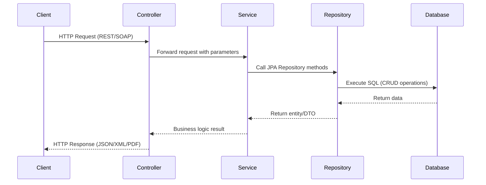

---

# 📘 Student Management System  

## 1. Overview  
The **Student Management System** is a Spring Boot application that exposes both **REST APIs** and **SOAP services** for managing student data. It integrates with a MySQL database and supports Excel uploads, reporting, and Base64‑encoded PDF generation.  

---

## 2. System Architecture  

### 🔹 Layers  
- **Presentation Layer**  
  - REST Controllers (`/api/...`)  
  - SOAP Endpoints (`/ws/...`)  

- **Service Layer**  
  - Business logic for student data processing  
  - Progress tracking and reporting  

- **Persistence Layer**  
  - JPA/Hibernate entities (`User`, `Lesson`, `Progress`, `Student`)  
  - MySQL database tables:  
    - `student_personal`  
    - `student_academic`  
    - `student_attendance`  
    - `student_sports`  

- **Integration Layer**  
  - Excel file upload (multipart/form-data)  
  - PDF report generation (Base64 encoding/decoding)  
  - External REST API calls for User and Lesson services  

---

## 3. REST API Endpoints  

| Endpoint | Method | Purpose | Notes |
|----------|--------|---------|-------|
| `/api/students/upload` | POST | Upload Excel file with student data | Requires `multipart/form-data` |
| `/api/students/personal` | GET | Fetch all student personal info | JSON response |
| `/api/students/academic` | GET | Fetch academic info | JSON response |
| `/api/students/attendance` | GET | Fetch attendance info | JSON response |
| `/api/students/sports` | GET | Fetch sports info | JSON response |
| `/api/students/report/{studentId}` | GET | Download student report as PDF | Returns `application/pdf` |
| `/api/test` | GET | Health check | Returns `"Service is up"` |

---

## 4. SOAP Service  

- **WSDL Endpoint**: `http://localhost/ws/student-report.wsdl`  
- **Request Format**:  
  ```xml
  <soapenv:Envelope xmlns:soapenv="http://schemas.xmlsoap.org/soap/envelope" xmlns:rep="http://student.com/report">
    <soapenv:Header/>
    <soapenv:Body>
      <rep:StudentReportRequest>
        <rep:studentId>19</rep:studentId>
      </rep:StudentReportRequest>
    </soapenv:Body>
  </soapenv:Envelope>
  ```
- **Response Format**:  
  ```xml
  <StudentReportResponse>
    <pdfBase64>Base64-encoded PDF data...</pdfBase64>
  </StudentReportResponse>
  ```

---

## 5. Authentication  

- **REST APIs**: Basic Auth (`username: aishwarya`, `password: password`)  
- **SOAP Service**: Basic Auth (`username: admin`, `password: admin`)  

---

## 6. Tools for Testing  

- **Postman** → REST API testing  
- **Curl** → CLI testing  
- **SoapUI** → SOAP + REST testing  
- **Swagger UI** → Optional integration  

---

## 7. Troubleshooting  

| Issue | Solution |
|-------|----------|
| `401 Unauthorized` | Enable Basic Auth in Postman/curl |
| `415 Unsupported Media Type` | Use `multipart/form-data` for uploads |
| Blank PDF | Ensure all student tables are populated |
| File not uploading | Verify correct form-data key (`file`) |
| SOAP empty response | Check if `studentId` exists |
| Corrupt PDF | Ensure Base64 string is copied fully without whitespace |

---

## 8. How to Run  

1. Start **MySQL** and ensure required tables exist.  
2. Place `StudentData_Upload_100_Records.xlsx` in project root.  
3. Run the application:  
   ```bash
   mvn spring-boot:run
   ```  

---

## 9. Architectural Flow Diagram (Conceptual)  

```
[Client] → [REST Controller / SOAP Endpoint] → [Service Layer] → [Repository Layer] → [MySQL DB]
       ↘ (Excel Upload / PDF Download) ↙
```

---

## 10. Sequence Diagram (Request Flow)



---

## 11. Extended Architectural Notes  

- **Controllers**: Handle REST (`ProgressController`, `StudentController`) and SOAP (`StudentReportEndpoint`) requests.  
- **Services**: Encapsulate business logic (e.g., `ProgressService`, `StudentService`).  
- **Repositories**: Use Spring Data JPA to interact with MySQL.  
- **Entities**: `User`, `Lesson`, `Progress`, `StudentPersonal`, etc.  
- **Integration Points**:  
  - REST API calls to fetch `User` and `Lesson` details.  
  - Excel upload for bulk student data.  
  - PDF generation with Base64 encoding for SOAP responses.  
- **Cross-Cutting Concerns**:  
  - Logging (Log4j2)  
  - Monitoring (Spring Boot Actuator)  
  - Authentication (Basic Auth)  

---

---

## 12. Component Diagram (Big Picture)

```mermaid
flowchart LR
    Client[Client Applications\n(Postman, SoapUI, Browser)] --> Controller[Controllers\nREST + SOAP Endpoints]
    Controller --> Service[Service Layer\nBusiness Logic]
    Service --> Repository[Repository Layer\nSpring Data JPA]
    Repository --> Database[(MySQL Database)]

    Controller --> Integration[Integration Layer]
    Integration --> Excel[Excel Upload\n(Multipart Form)]
    Integration --> PDF[PDF Generator\n(Base64 Encoding)]
    Integration --> ExternalAPI[External REST APIs\n(User & Lesson Services)]
```

---

## 13. Architectural Highlights  

- **Client Applications**: Postman, SoapUI, browsers, or other consumers.  
- **Controllers**: REST endpoints (`StudentController`, `ProgressController`) and SOAP endpoints (`StudentReportEndpoint`).  
- **Service Layer**: Encapsulates business logic for student data, progress tracking, and reporting.  
- **Repository Layer**: Uses Spring Data JPA to persist entities (`User`, `Lesson`, `Progress`, `StudentPersonal`, etc.) into MySQL.  
- **Database**: Central storage for student records and progress.  
- **Integration Layer**:  
  - Excel upload for bulk student data ingestion.  
  - PDF generation for reports (Base64 encoded for SOAP).  
  - External REST API calls to fetch `User` and `Lesson` details.  

---

## 14. Combined View  

- **Static Architecture**: Component diagram shows the modules and their relationships.  
- **Dynamic Flow**: Sequence diagram illustrates how a request moves through the system.  
- **Cross‑Cutting Concerns**: Logging (Log4j2), monitoring (Spring Boot Actuator), and authentication (Basic Auth).  

---

## 15. Deployment Diagram (Infrastructure View)

```mermaid
graph TD
    Client[Client Devices\n(Postman, Browser, SoapUI)] -->|HTTP/HTTPS| SpringBootApp[Spring Boot Application\n(Student Management System)]

    SpringBootApp -->|JPA/Hibernate| MySQL[(MySQL Database)]
    SpringBootApp -->|REST API Calls| ExternalServices[External Services\n(User & Lesson APIs)]
    SpringBootApp -->|File Upload| Excel[Excel Files\n(Student Data Upload)]
    SpringBootApp -->|PDF Generation| PDF[PDF Reports\n(Base64 Encoding)]

    subgraph Server
        SpringBootApp
        MySQL
    end
```

---

## 16. Deployment Notes  

- **Runtime Environment**:  
  - Java 17  
  - Spring Boot 3.x  
  - Deployed on local server or cloud (Tomcat embedded in Spring Boot).  

- **Database**:  
  - MySQL instance running locally or on cloud (AWS RDS, Azure MySQL, etc.).  
  - Tables: `student_personal`, `student_academic`, `student_attendance`, `student_sports`.  

- **External Integrations**:  
  - REST API calls to fetch `User` and `Lesson` details from external microservices.  
  - Excel file ingestion for bulk student data.  
  - PDF generation for student reports, encoded in Base64 for SOAP responses.  

- **Clients**:  
  - REST consumers (Postman, browser, mobile apps).  
  - SOAP consumers (SoapUI, enterprise systems).  

---

## 17. Complete Architectural Views  

- **Static View** → Component Diagram (modules and relationships).  
- **Dynamic View** → Sequence Diagram (request flow).  
- **Deployment View** → Deployment Diagram (runtime infrastructure).

---

## 18. Data Flow Diagram (DFD – Level 1)

```mermaid
flowchart LR
    ExcelFile[Excel File Upload] -->|Bulk Student Data| Controller[REST Controller]
    Controller --> Service[Service Layer]
    Service --> Repository[Repository Layer]
    Repository --> Database[(MySQL Database)]

    Database --> Service
    Service --> PDFGenerator[PDF Generator\n(Base64 Encoding)]
    PDFGenerator --> SOAPClient[SOAP Client\n(Enterprise Systems)]
    Service --> RESTClient[REST Client\n(Postman, Browser, Mobile Apps)]
```

---

## 19. Data Flow Explanation  

- **Excel Upload**:  
  - Users upload Excel files containing student records.  
  - Controller parses and forwards data to the service layer.  

- **Database Persistence**:  
  - Service layer validates and normalizes data.  
  - Repository layer persists records into MySQL tables (`student_personal`, `student_academic`, etc.).  

- **Data Retrieval**:  
  - REST clients query student info via JSON endpoints.  
  - SOAP clients request reports via WSDL service.  

- **Report Generation**:  
  - Service layer compiles student data into PDF reports.  
  - Reports are Base64‑encoded for SOAP responses.  

---

## 20. Complete Architectural Views  

- **Static View** → Component Diagram (modules and relationships).  
- **Dynamic View** → Sequence Diagram (request flow).  
- **Deployment View** → Deployment Diagram (runtime infrastructure).  
- **Process View** → Data Flow Diagram (data movement).  

