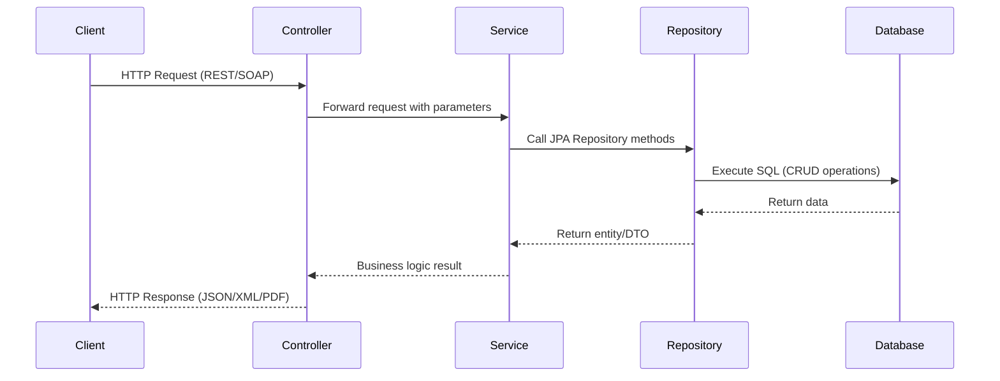
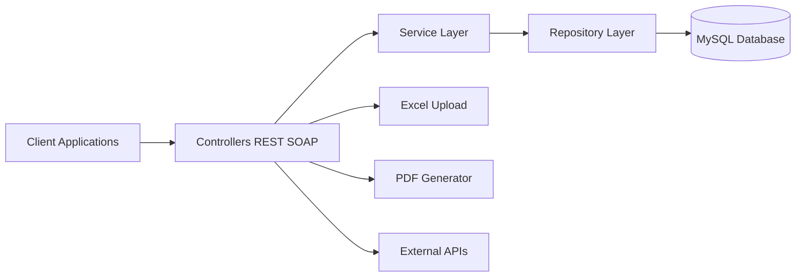
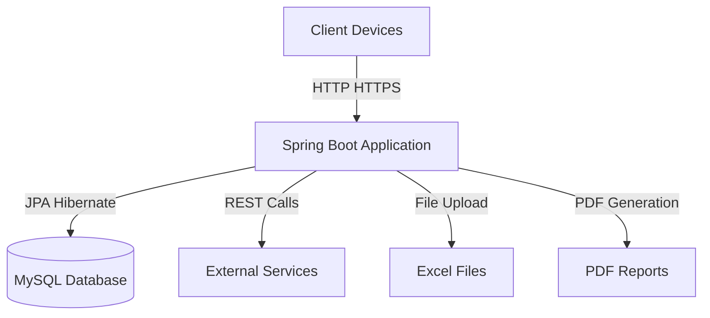
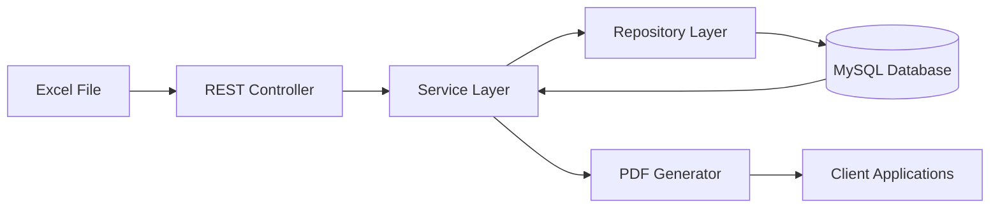

---
📘 Student Management System
1. Overview
The Student Management System is a Spring Boot application that exposes both REST APIs and SOAP services for managing student data.  
It integrates with a MySQL database, supports Excel uploads, generates PDF reports, and uses Base64 encoding for SOAP responses.
---
2. System Architecture
🔹 Layered Architecture
Presentation Layer
REST Controllers (`/api/...`)
SOAP Endpoints (`/ws/...`)
Service Layer
Business logic for student data processing
Progress tracking and reporting
Persistence Layer
JPA/Hibernate entities (`User`, `Lesson`, `Progress`, `StudentPersonal`)
MySQL tables: `student_personal`, `student_academic`, `student_attendance`, `student_sports`
Integration Layer
Excel file upload (multipart/form-data)
PDF report generation (Base64 encoding/decoding)
External REST API calls for User and Lesson services
---
3. REST API Endpoints
Endpoint	Method	Purpose	Notes
`/api/students/upload`	POST	Upload Excel file with student data	Requires multipart/form-data
`/api/students/personal`	GET	Fetch all student personal info	JSON response
`/api/students/academic`	GET	Fetch academic info	JSON response
`/api/students/attendance`	GET	Fetch attendance info	JSON response
`/api/students/sports`	GET	Fetch sports info	JSON response
`/api/students/report/{studentId}`	GET	Download student report as PDF	Returns `application/pdf`
`/api/test`	GET	Health check	Returns `"Service is up"`
---
4. SOAP Service
WSDL Endpoint: `http://localhost/ws/student-report.wsdl`
Request Format:
```xml
<soapenv:Envelope xmlns:soapenv="http://schemas.xmlsoap.org/soap/envelope" xmlns:rep="http://student.com/report">
   <soapenv:Header/>
   <soapenv:Body>
      <rep:StudentReportRequest>
         <rep:studentId>19</rep:studentId>
      </rep:StudentReportRequest>
   </soapenv:Body>
</soapenv:Envelope>
```
Response Format:
```xml
<StudentReportResponse>
   <pdfBase64>Base64-encoded PDF data...</pdfBase64>
</StudentReportResponse>
```
---
5. Authentication
REST APIs: Basic Auth (`username: aishwarya`, `password: password`)
SOAP Service: Basic Auth (`username: admin`, `password: admin`)
---
6. Tools for Testing
Postman → REST API testing
Curl → CLI testing
SoapUI → SOAP + REST testing
Swagger UI → Optional integration
---
7. Troubleshooting
Issue	Solution
401 Unauthorized	Enable Basic Auth in Postman/curl
415 Unsupported Media Type	Use multipart/form-data for uploads
Blank PDF	Ensure all student tables are populated
File not uploading	Verify correct form-data key (`file`)
SOAP empty response	Check if `studentId` exists
Corrupt PDF	Ensure Base64 string is copied fully without whitespace
---
8. How to Run
Start MySQL and ensure required tables exist.
Place `StudentData_Upload_100_Records.xlsx` in project root.
Run the application:
```bash
mvn spring-boot:run
```
---
9. Sequence Diagram (Request Flow)

---
10. Component Diagram (Static View)

---
11. Deployment Diagram (Infrastructure View)

---
12. Data Flow Diagram (Process View)

---
13. Architectural Highlights
Client Applications: Postman, SoapUI, browsers, or enterprise systems
Controllers: REST endpoints (`StudentController`, `ProgressController`) and SOAP endpoints (`StudentReportEndpoint`)
Service Layer: Encapsulates business logic for student data, progress tracking, and reporting
Repository Layer: Uses Spring Data JPA to persist entities into MySQL
Database: Central storage for student records and progress
Integration Layer: Excel upload, PDF generation, external REST API calls
Cross-Cutting Concerns: Logging (Log4j2), Monitoring (Spring Boot Actuator), Authentication (Basic Auth)
---
14. Complete Architectural Views
Static View → Component Diagram
Dynamic View → Sequence Diagram
Deployment View → Deployment Diagram
Process View → Data Flow Diagram
---
